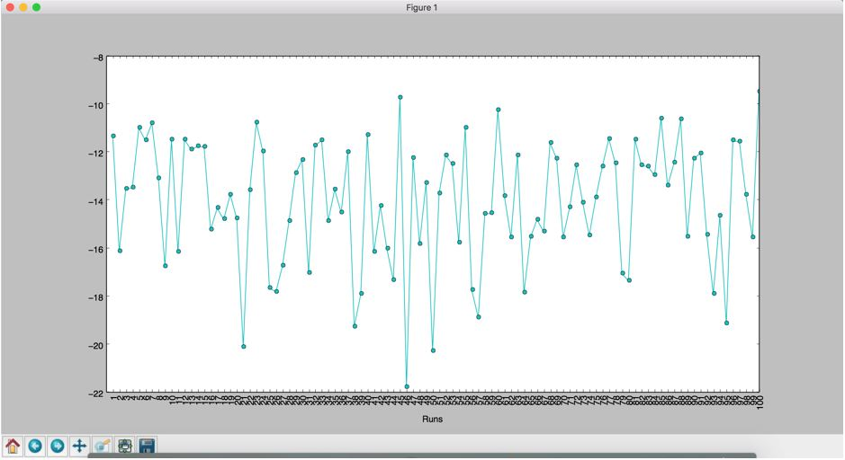
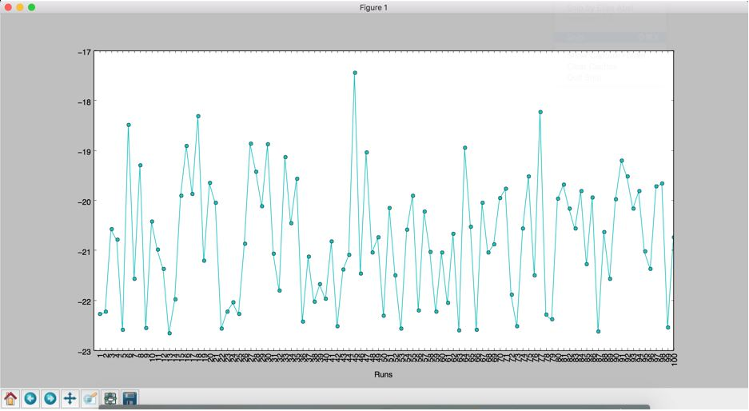

### Hill Climbing Algorithm
The implementation of Hill Climbing algorithm to find the minimum value of Ackley's function is file named hill_climb_search.py.

The initial position was chosen randomly and the next position is calculated with following equations:

    X' = (rand() – 0.5) * 0.1 + X
    Y' = (rand() – 0.5) * 0.1 + Y
    
Every new point is used to calculate ackley's value and checked with exsiting minimum value. The iteration is terminated when a minimum value is not found in last 100 iterations.

### Differential Evolution Algorithm
The implementation of Differential Evolution algorithm to find the minimum value of Ackley's function is file named differential_evolution.py.

Here, a population of 20 random points are selected initially and every new point is calculated by selecting 3 points from the population.
The mutation is as follows:

    New_position = a + Mutation_Factor * (b - c)  where a,b,c are 3 random different positions in given population

Every new point is used to calculate ackley's value and checked with exsiting minimum value. The iteration is terminated when a minimum value is not found in last 100 iterations.

#### Analysis

**Output of Hill Climbing Algorithm**

In this algorithm, the minimum doesn't reach global minimum every time and it mostly terminates at a value of -20.

**Output of Hill Climbing Algorithm**

In this algorithm, the minimum reaches global minimum almost every time with value -22.7 obtained at position (0,0). It is clear that it doesn't stop at local minima as it continously learning from previous values (that is, parent values).

### Travelling Salesman Problem

In this, genetic algorithm is used to find the least cost path which covers all the given cities.

Following are steps used to find solution in genetic algorithm.

1. A population of 30 radom paths are taken initially.
2. A roulette is computed using the inverse of the cost for each path. Generally, area in a roulette is proportional to the cost of the path if our goal is to find the maximum cost path. Here we are looking for a path which has the least value, which means we need to consider inverse of the path cost while building the roulette to make selection.
3. Among the 30 paths, a decision has to be made whether it has to be selected for crossover or not. So a random number is generated and compared with crossover probability. This way we get n out of 30 paths which are ready for crossover.
4. Implemented first order crossover and partially mapped crossover of the 'n' paths.
5. The next step is mutation where I implemented Scramble mutation, after which the least cost is calculated in the population after the recombination methods to see if it is less than what we've obtained till now. 
6. It is terminated when a least cost is found in previous 5000 iterations.

