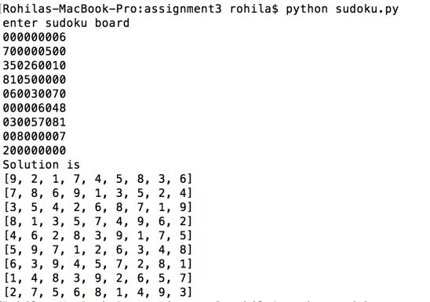

## Sudoku Solver 

### Input and Execution of program

#### Sample Input and Output:

To execute the program, use the following command:

    python sudoku.py 
    python mrv.py

Now enter the input and press enter, solution will be displayed.

The puzzle is solved in two methods namely Naive backtracking and Smart backtracking.

### Naive Backtracking
This is the basic backtracking method, where we place all values from 1-9 and check if the puzzle is solved. If a situation arises where in puzzle is not solved yet and a empty position can't filled filled with any number, we have to backtrack and check with the next value on the line. This method results in lot of unnecessary branching.

### Smart Backtracking
Here, i have used minimum remaining values(MRV) heuristic along with naive backtracking algorithm. In this, we initially fill the empty spaces which has least domain of possible values and then the next space and so on. Each time the domains of all empty spaces are calculated and depending on that the positions are filled with values.

### Analysis
Naive backtracking method takes lot of time compared to smart backtracking method and also the number of backtracked steps are more.
